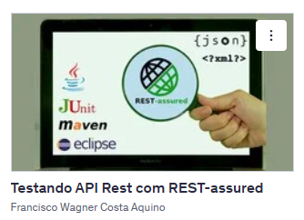

# Curso de Testes de API Rest com REST-assured

  

Este projeto faz parte do curso **"Testando API Rest com REST-assured"** ministrado por Francisco Wagner Costa Aquino na Udemy.

## Objetivo

O objetivo do curso é ensinar como realizar testes automatizados em APIs REST utilizando a biblioteca REST-assured, JUnit e Maven, com exemplos práticos em Java.

## Tecnologias Utilizadas

- **Java**
- **REST-assured**
- **JUnit**
- **Maven**
- **Eclipse** (IDE sugerida)

## Estrutura do Projeto

O projeto contém exemplos de testes automatizados para APIs REST, incluindo:

- Testes de requisições HTTP
- Validação de respostas
- Integração com JUnit

## Como executar

1. Instale o Maven e o Java JDK.
2. Clone este repositório.
3. Execute `mvn clean install` para baixar as dependências e rodar os testes.

## Créditos

Curso ministrado por **Francisco Wagner Costa Aquino** na Udemy.

---
*Este projeto é apenas para fins educacionais.*
